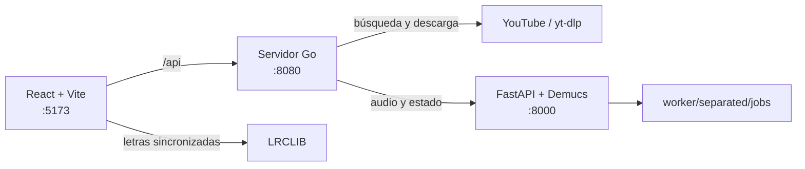

# GoSing

GoSing es una aplicación web de karaoke que busca canciones en YouTube o recibe archivos de audio, separa voces e instrumental con Demucs y ofrece un reproductor sincronizado con letras de LRCLIB.

> **Estado del proyecto:** MVP orientado a ejecución local. Los servicios usan puertos fijos y la integración entre el backend y el worker apunta a `127.0.0.1`; todavía no es una configuración lista para exponer directamente en producción.

## Qué permite hacer

- Buscar canciones y sugerencias de YouTube.
- Descargar audio de YouTube como MP3 o subir archivos MP3, WAV, M4A, OGG y FLAC.
- Procesar audio con Demucs (`htdemucs`, separación de voces). La solicitud multipart completa tiene un límite de 20 MiB, por lo que el archivo debe ser ligeramente menor.
- Reproducir las pistas vocal e instrumental de manera sincronizada.
- Ajustar el volumen de la voz original durante la reproducción.
- Buscar y mostrar letras sincronizadas desde LRCLIB.
- Consultar el estado del procesamiento en segundo plano.

## Arquitectura



| Componente | Responsabilidad |
| --- | --- |
| `frontend/` | Interfaz React, búsqueda, carga, reproducción dual y letras sincronizadas. |
| `cmd/server/` | Servidor HTTP, API pública y entrega del frontend compilado. |
| `internal/` | Casos de uso, adaptadores, handlers y observabilidad del backend Go. |
| `worker/` | Worker FastAPI que ejecuta Demucs y administra los resultados temporales. |

El frontend consulta el estado de los trabajos cada tres segundos. El worker admite un único procesamiento simultáneo para proteger CPU, GPU y memoria.

## Requisitos

- Go `1.26.5` — versión declarada en `go.mod`.
- Node.js con Corepack.
- pnpm `11.21.0` — fijado en `frontend/package.json`.
- Python 3 con soporte para entornos virtuales.
- `yt-dlp` disponible en `PATH`.
- `curl` y `setsid` para usar `start.sh`.
- Un entorno compatible con PyTorch y Demucs. La aceleración disponible depende del hardware y de la instalación local de PyTorch.

## Inicio rápido

### 1. Clonar el repositorio

```bash
git clone https://github.com/choqooz/goSing.git
cd goSing
```

### 2. Instalar el frontend

```bash
corepack enable
corepack pnpm --dir frontend install --frozen-lockfile
```

### 3. Preparar el worker

```bash
python3 -m venv worker/venv
worker/venv/bin/python -m pip install --upgrade pip
worker/venv/bin/python -m pip install -r worker/requirements.txt
```

La instalación de Demucs puede requerir una variante específica de PyTorch según tu sistema operativo, CPU o GPU. Consultá la documentación de PyTorch antes de reemplazar paquetes de ese entorno.

### 4. Instalar y verificar `yt-dlp`

Instalá `yt-dlp` con el método recomendado para tu sistema y confirmá que sea ejecutable:

```bash
yt-dlp --version
```

### 5. Iniciar todos los servicios

```bash
./start.sh
```

El launcher valida las dependencias, compila el frontend si falta `frontend/dist/`, inicia los tres servicios y espera sus health checks. Presioná `Ctrl+C` para detenerlos.

| Servicio | Dirección |
| --- | --- |
| Frontend de desarrollo | <http://127.0.0.1:5173> |
| Backend Go | <http://127.0.0.1:8080> |
| Worker FastAPI | <http://127.0.0.1:8000> |

## Compilación

El build de producción instala las dependencias del frontend con el lockfile, compila la SPA y genera un binario Go con los archivos estáticos embebidos:

```bash
./build.sh
./gosing
```

Para elegir otra ruta de salida —cuyo directorio padre ya debe existir—:

```bash
./build.sh /tmp/gosing
```

## Verificación

### Backend Go

```bash
go test ./...
go vet ./...
```

### Frontend

```bash
corepack pnpm --dir frontend run lint
corepack pnpm --dir frontend run test
corepack pnpm --dir frontend run build
```

### Worker

```bash
worker/venv/bin/python worker/test_main.py
```

## Endpoints principales

### Backend Go

| Método | Endpoint | Uso |
| --- | --- | --- |
| `GET` | `/api/health` | Estado del backend. |
| `GET` | `/api/audio/suggest?q=...` | Sugerencias de búsqueda. |
| `GET` | `/api/audio/search?q=...` | Búsqueda de canciones. |
| `POST` | `/api/audio/upload` | Carga de un archivo local. |
| `POST` | `/api/audio/download` | Descarga y procesamiento de un video. |
| `GET` | `/api/audio/status?job_id=...` | Estado de un trabajo. |

### Worker

| Método | Endpoint | Uso |
| --- | --- | --- |
| `GET` | `/health` | Liveness del proceso. |
| `GET` | `/ready` | Disponibilidad del directorio de trabajo y Demucs. |
| `POST` | `/api/process` | Inicio de la separación de audio. |
| `GET` | `/api/status/{job_id}` | Estado interno del trabajo. |
| `GET` | `/audio/jobs/...` | Archivos separados mientras estén retenidos. |

## Ciclo de vida del audio

- Los archivos de entrada temporales se eliminan al completar o fallar el procesamiento.
- Los resultados válidos quedan en `worker/separated/jobs/<job-id>/` y pasan a ser elegibles para limpieza después de 24 horas.
- La limpieza es diferida: ocurre al iniciar el worker o durante operaciones posteriores, por lo que los archivos pueden seguir accesibles después del vencimiento hasta que se ejecute ese proceso.
- Los resultados se sirven sin autenticación mientras permanezcan almacenados.
- Los trabajos en curso no sobreviven a un reinicio como tareas reanudables: se marcan como interrumpidos.
- El worker usa tareas en memoria de FastAPI; no es una cola durable.
- Si la capacidad está ocupada, el worker responde `429` con un tiempo de reintento de 60 segundos.

## Limitaciones actuales

- El backend espera al worker en `http://127.0.0.1:8000`.
- Las URLs de audio generadas por el worker también apuntan a `127.0.0.1`; un navegador en otra máquina no podrá resolverlas correctamente.
- Puertos, concurrencia y retención todavía no se configuran mediante variables de entorno.
- Las dependencias Python no tienen versiones fijadas.
- No hay autenticación para los archivos procesados.
- El uso de contenido descargado desde YouTube debe respetar sus términos y la legislación aplicable.

## Estructura del repositorio

```text
.
├── cmd/server/          # Punto de entrada del backend Go
├── docs/                # Baseline operativa y decisiones técnicas
├── frontend/            # SPA React + Vite y archivos embebidos
├── internal/            # Dominio, adaptadores, handlers y observabilidad
├── worker/              # API FastAPI y separación con Demucs
├── build.sh             # Build reproducible del frontend y binario Go
└── start.sh             # Launcher local de los tres servicios
```

Los binarios, dependencias, cookies, archivos MP3/WAV, resultados de Demucs y metadatos locales de herramientas están excluidos mediante `.gitignore`.

## Documentación adicional

- [`docs/operational-baseline.md`](docs/operational-baseline.md): puertos, health checks, capacidad, retención, timeouts y observabilidad.
- [`PRD.md`](PRD.md): visión y requisitos originales del producto.
- [`SDD.md`](SDD.md): diseño inicial y decisiones de arquitectura.

Cuando la documentación histórica difiera del comportamiento actual, la implementación y la baseline operativa describen el estado vigente.
